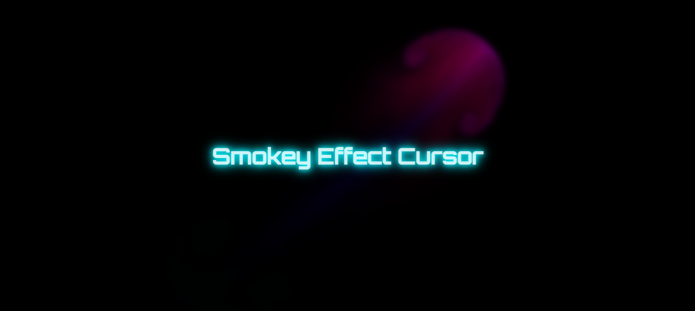

# 💨 Smokey Effect Cursor 💨

A visually dynamic **smokey trail cursor** effect using HTML, CSS, and JS. This project creates a smooth,
fluid-like trail that follows the mouse, mimicking a smoky visual effect — perfect for creative portfolios, landing
pages, or interactive web experiments

## 🛠️ Tech Stack

✅ HTML 
✅ CSS 
✅ JS 

## 🚀 Features

✅ Smooth, dynamic smokey cursor trail. 
✅ Fully responsive and lightweight. 
✅ Easily customizable styles and motion behavior. 

### 🔗 [Live Demo](https://kavithma-thushal.github.io/Smokey-Effect-Cursor/)

## 📸 Screenshots

## 📝 Version

**1.0.0**

## 📬 Get in Touch

If you encounter any issues, have questions, or need assistance with the code, feel free to reach out!

📧 [kavithmathushal9007@gmail.com](mailto:kavithmathushal9007@gmail.com)

#### This project is licensed under the [Apache License](LICENSE)

#### © 2025 All Rights Reserved | Designed by [Kavithma Thushal](https://github.com/Kavithma-Thushal)

